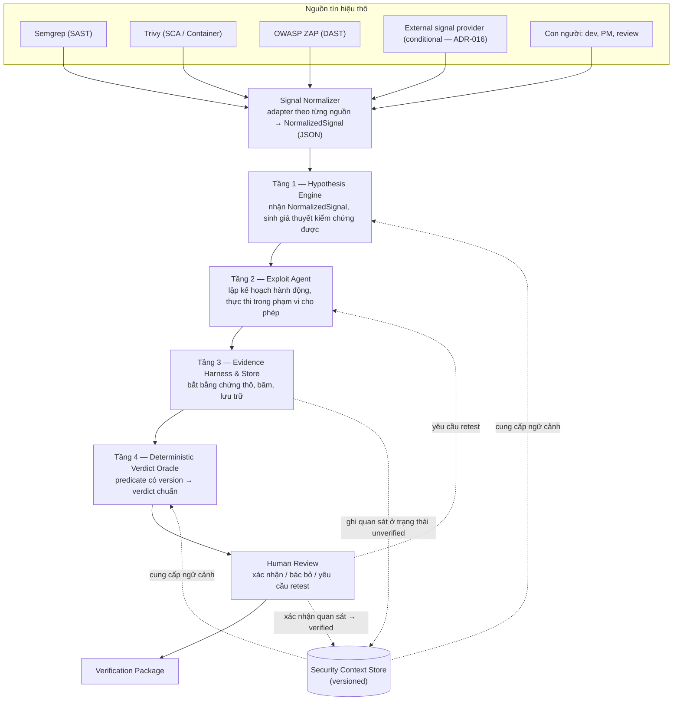
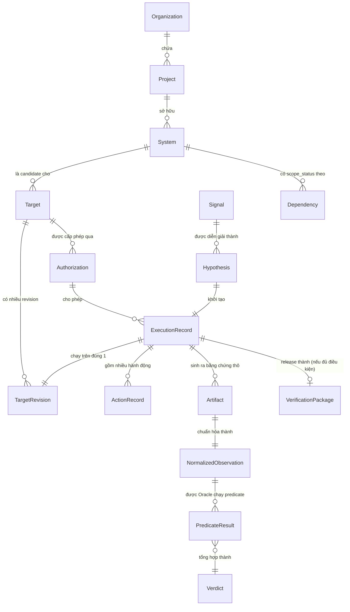
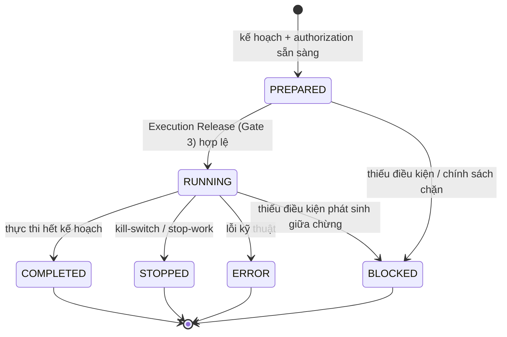
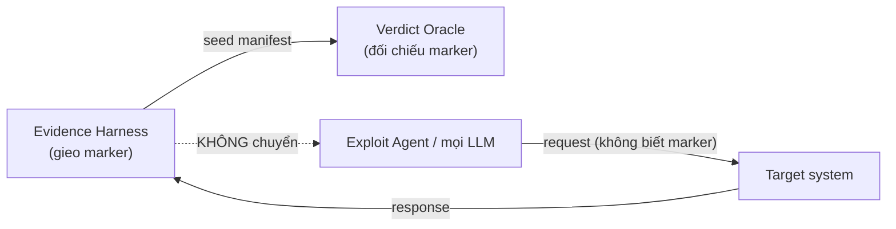
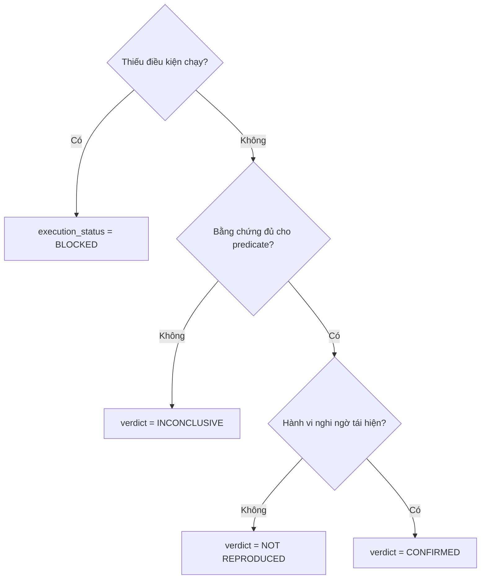
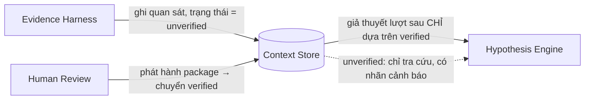
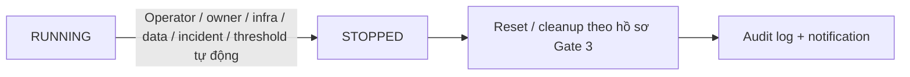
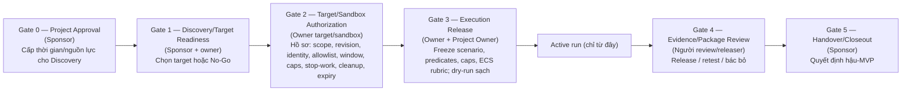
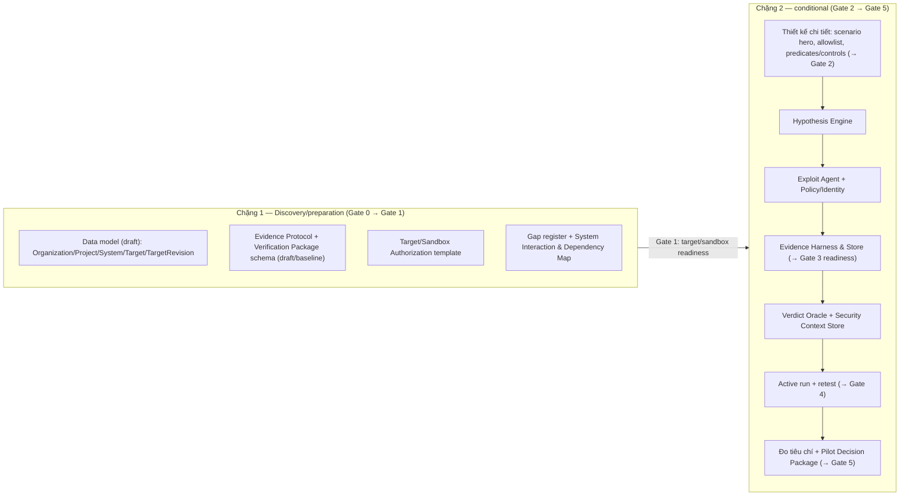

# SecWeave — Đặc tả kiến trúc hệ thống

> **Về tài liệu này.** Đây là bản diễn giải **kỹ thuật/kiến trúc** của hệ thống SecWeave, tổng hợp từ `A.html` (`SECWEAVE-DEC-BRIEF-001`, v1.0). `A.html` là tài liệu **quyết định phê duyệt** — trả lời "vì sao làm, tốn gì, rủi ro gì" cho Sponsor. Tài liệu này trả lời một câu khác: **hệ thống được cấu tạo như thế nào, gồm thành phần gì, dữ liệu và luồng xử lý ra sao**. Khi hai tài liệu mâu thuẫn về phạm vi/số liệu/lịch trình, `A.html` là nguồn có giá trị pháp lý/phê duyệt; tài liệu này chỉ để hiểu và triển khai kỹ thuật.
>
> Mọi thứ đánh dấu **`TBD`** hoặc **`Proposed`** trong tài liệu này được giữ nguyên trạng thái mở như trong `A.html` — không tự chốt giá trị.

---

## Mục lục

1. [Tổng quan](#1-tổng-quan)
2. [Kiến trúc tổng thể](#2-kiến-trúc-tổng-thể)
3. [Mô hình dữ liệu](#3-mô-hình-dữ-liệu)
4. [Đặc tả từng tầng](#4-đặc-tả-từng-tầng)
5. [Vòng đời một lượt verification](#5-vòng-đời-một-lượt-verification)
6. [Kiểm soát & an toàn](#6-kiểm-soát--an-toàn)
7. [Verification Package — 19 trường](#7-verification-package--19-trường)
8. [Đo lường](#8-đo-lường)
9. [Ánh xạ kiến trúc theo giai đoạn triển khai](#9-ánh-xạ-kiến-trúc-theo-giai-đoạn-triển-khai)
10. [Công nghệ & giới hạn kỹ thuật MVP](#10-công-nghệ--giới-hạn-kỹ-thuật-mvp)
11. [Phụ lục — Thuật ngữ](#11-phụ-lục--thuật-ngữ)

---

## 1. Tổng quan

**SecWeave là một quy trình có công cụ hỗ trợ, dùng để xác minh một số ít security finding trên một hệ thống nội bộ đã được cấp phép, và trả về một gói bằng chứng có thể kiểm tra lại được kèm một kết luận tất định.**

Nguyên tắc cốt lõi chi phối toàn bộ kiến trúc:

> **Bên tạo ra giả thuyết không được tự chấm bài của mình.**

Nếu một model vừa sinh giả thuyết, vừa thực thi, vừa mô tả bằng chứng, vừa kết luận, thì finding cuối cùng dựa trên lời tự thuật của model — không có cách nào kiểm tra model đã thực sự làm gì. Toàn bộ kiến trúc bên dưới là hệ quả của việc phân tách bốn quyền này ra bốn thành phần khác nhau.

### 1.1. Sáu nguyên tắc thiết kế

| # | Nguyên tắc | Hệ quả kỹ thuật |
|---|---|---|
| **P1** | Tín hiệu không phải kết luận — kết quả scanner/AI/con người đều chỉ là *hypothesis* | Có tầng riêng để sinh giả thuyết, tách khỏi tầng phán quyết |
| **P2** | Bằng chứng trước, phát biểu sau — không có artifact thì không có phát biểu | Evidence Harness bắt bằng chứng thô trước khi có bất kỳ diễn giải |
| **P3** | Phán quyết phải xác định — cùng bằng chứng → cùng verdict, bất kể model/người chạy | Oracle là rule engine có version, **không gọi LLM** |
| **P4** | Không chạy khi chưa được phép | Authorization reference là trường bắt buộc; thiếu → dừng ở `BLOCKED` |
| **P5** | Con người giữ quyền cuối | Human Review là bước bắt buộc trước khi package được phát hành |
| **P6** | Chi phí và phạm vi tác động phải có trần | Cost Service + action allowlist chặn ở mức cấu hình, không phụ thuộc thiện chí |

Nếu một quyết định kỹ thuật mâu thuẫn với sáu nguyên tắc này, quyết định đó phải được ghi thành ADR và được Sponsor duyệt — sáu nguyên tắc này ở trên mọi quyết định thiết kế cụ thể.

---

## 2. Kiến trúc tổng thể

### 2.1. Sơ đồ bốn tầng



### 2.2. Thành phần và trách nhiệm

| Thành phần | Vai trò | Loại |
|---|---|---|
| **Signal Normalizer** | Adapter theo từng nguồn (Semgrep/Trivy/OWASP ZAP/nguồn khác) ánh xạ output thô về một schema JSON chung (`NormalizedSignal`, §4.1.1) trước khi vào Hypothesis Engine | Deterministic mapping, không diễn giải |
| **Hypothesis Engine** | Nhận `NormalizedSignal` đã chuẩn hoá → sinh giả thuyết có cấu trúc, kiểm chứng được | AI-assisted |
| **Exploit Agent** (`FR-AGT`, còn gọi *controlled validation agent*) | Lập kế hoạch hành động cho một giả thuyết, đối chiếu allowlist, thực thi sau Execution Release | AI-assisted, có kiểm soát |
| **Evidence Harness & Store** | Bắt bằng chứng thô tại thời điểm thực thi, băm, lưu, sinh normalized observation | Deterministic, không diễn giải |
| **Verdict Oracle** | Chạy predicate có version trên normalized observation → 1 trong 3 verdict | **Rule code thuần, không gọi LLM** |
| **Human Review Loop** | Đọc package, đối chiếu raw evidence, quyết định phát hành/retest/bác bỏ | Con người |
| **Security Context Store** | Bộ nhớ có version giữa các lần chạy (SQLite ở MVP) | Persistent store |
| **Nền tảng dùng chung** | Config, Identity (test identity), Policy (allowlist/caps), Logging/Audit, Cost | Infrastructure — điều kiện để 4 tầng trên được phép chạy, không phải "tính năng nâng cao" |

### 2.3. Bảng phân quyền bốn tầng — được / không được làm gì

| Tầng | Được phép | **Không** được phép |
|---|---|---|
| **Hypothesis Engine** | Đọc source đã duyệt, nhận tín hiệu SAST, sinh giả thuyết, dùng LLM | Gửi request; biết blind marker; đưa verdict |
| **Exploit Agent** | Đề xuất và thực hiện hành động qua Harness | Đổi allowlist; tự lấy credential; biết marker; đưa verdict |
| **Evidence Harness** | Áp policy, gửi request trong active run sau Gate 3, ghi và hash bằng chứng | Diễn giải ý nghĩa nghiệp vụ của bằng chứng |
| **Verdict Oracle** | Đọc bằng chứng, áp rule, trả một trong ba trạng thái | Gọi LLM; dùng model confidence; quyết định severity |

Con người ở **ngoài** bốn tầng: được bổ sung ngữ cảnh nghiệp vụ, yêu cầu chạy lại, sửa rule cho lần sau, đính chính finding sai — nhưng **không được sửa bằng chứng gốc** và **không được biến một kết quả thiếu bằng chứng thành `CONFIRMED`**.

### 2.4. AI làm gì / không làm gì theo từng giai đoạn xử lý

Đây là bảng quan trọng nhất để hiểu vì sao thiết kế không tin vào "lời AI nói" — nó tách theo **giai đoạn xử lý**, chồng lên bảng phân quyền theo tầng ở trên:

| Giai đoạn | AI được làm | AI **không** được làm |
|---|---|---|
| Hypothesis | Đọc code, tín hiệu, ngữ cảnh; đề xuất giả thuyết + tiêu chí quan sát | Kết luận có/không có lỗ hổng |
| Plan | Soạn dự thảo kế hoạch hành động | Tự mở rộng phạm vi ngoài allowlist |
| Execute | Sinh tham số cho hành động đã nằm trong allowlist | Tự cấp phép, tự đổi target/revision |
| Capture | Không tham gia | Sinh, sửa, tóm tắt thay cho bằng chứng thô |
| Adjudicate | Không tham gia | Ra verdict dưới mọi hình thức |
| Report | Soạn phần diễn giải, giới hạn, đề xuất bước tiếp | Thay đổi verdict hoặc predicate results |

**Bốn cơ chế chống thiên lệch** (áp dụng mọi kịch bản):
(a) verdict chỉ sinh từ predicate chạy trên bằng chứng runtime, không từ văn bản model sinh ra;
(b) mọi giả thuyết lưu *provenance* (whitebox hay blackbox) để người review biết nền tảng kết luận;
(c) action record đủ chi tiết để một người lặp lại bằng tay — mọi `CONFIRMED` có đường kiểm chứng độc lập không cần AI;
(d) predicate/rule version ghi trong package → hai lượt chạy trên cùng bằng chứng phải cho cùng verdict.

Với lớp kịch bản áp dụng được, có cơ chế thứ năm: **blind marker** — chi tiết ở [§4.3](#43-tầng-3--evidence-harness--store).

---

## 3. Mô hình dữ liệu

### 3.1. Entity chính và quan hệ



### 3.2. Ghi chú thiết kế quan trọng

- Giới hạn của MVP là **phạm vi vận hành, không phải kiến trúc**. Data model có sẵn `Organization → Project → System → Target → TargetRevision → Authorization`; MVP chỉ triển khai **đúng một nhánh** (một target, một revision, một identity). Mở target thứ hai là *thêm cấu hình và thêm một authorization*, không phải viết lại hệ thống.
- **`Authorization` ≠ một bản ghi duy nhất theo nghĩa "toàn quyền"**. Có ba lớp cấp phép chồng lên nhau và đều tham chiếu tới `Target`/`TargetRevision`:
  - *Project Approval* (Gate 0) — không gắn với target cụ thể, chỉ cấp thời gian/nguồn lực.
  - *Target/Sandbox Authorization* (Gate 2) — gắn với đúng một target/sandbox, một revision, một identity, một cửa sổ thời gian, danh sách hành động.
  - *Execution Release* (Gate 3) — gắn với đúng một scenario cụ thể trong khuôn khổ Authorization còn hiệu lực.
  Không có `ExecutionRecord` nào hợp lệ nếu thiếu tham chiếu tới cả ba lớp trên (xem [§6](#6-kiểm-soát--an-toàn)).

### 3.3. State machine — `scope_status`

Cơ chế chặn phạm vi ở **mức dữ liệu**, không phải mức quy trình — mỗi dependency/thành phần được gắn nhãn:

| Giá trị | Ý nghĩa | Hành động được phép |
|---|---|---|
| `TARGET` | Đối tượng kiểm chứng đã được cấp phép | Đọc + thực thi trong allowlist |
| `AUTHORIZED_DEPENDENCY` | Phụ thuộc đã được owner cho phép | Đọc + thực thi giới hạn theo cấp phép riêng |
| `OBSERVE_ONLY` | Được phép quan sát, không tác động | Chỉ đọc/quan sát |
| `CONTEXT_ONLY` | Chỉ dùng để hiểu ngữ cảnh | Không truy cập runtime |
| `OUT_OF_SCOPE` | Ngoài phạm vi | Không truy cập |
| `UNKNOWN` | Chưa xác định | **Mặc định chặn như `OUT_OF_SCOPE`** |

Ngữ cảnh liên dự án được phép **đọc** để hiểu quan hệ hệ thống (System Interaction and Dependency Map), nhưng **không** cho phép thực thi tự động sang dự án khác. Mọi hành động runtime luôn giới hạn trong `TARGET` và `AUTHORIZED_DEPENDENCY` của chính lượt chạy đó. Nếu một hành vi phía downstream là điều kiện bắt buộc để khẳng định lỗ hổng mà SecWeave không có quyền/bằng chứng độc lập về phía đó → verdict **phải** là `INCONCLUSIVE`, không được suy diễn.

### 3.4. State machine — `execution_status`



**Quy tắc ánh xạ verdict theo execution_status** (ma trận authoritative, Mục 8.3 A.html):

| `execution_status` | Có thể có final verdict? |
|---|---|
| `PREPARED`, `RUNNING` | Chưa có verdict |
| `COMPLETED` | Có thể có cả 3 verdict: `CONFIRMED` / `NOT REPRODUCED` / `INCONCLUSIVE` |
| `BLOCKED`, `STOPPED`, `ERROR` | **Không có final verification verdict.** Nếu một biểu mẫu buộc phải ghi gì đó → chỉ được ghi `INCONCLUSIVE`, và record đó **không tự động là Verification Package đã release đủ 19 trường** |

> `execution_status` (vòng đời kỹ thuật của một lượt chạy), `verification verdict` (kết luận của kịch bản/evidence) và `pilot outcome` (kết quả cấp dự án) là **ba trục độc lập** — không được suy ra trục này từ trục khác.

---

## 4. Đặc tả từng tầng

### 4.1. Tầng 1 — Hypothesis Engine

**Chức năng:** nhận **tín hiệu đã chuẩn hoá** (`NormalizedSignal`, §4.1.1) từ nhiều nguồn — SAST, SCA/container, DAST, mô tả dev, ghi chú review, tùy chọn external signal provider — và biến thành **giả thuyết kiểm chứng được**. Việc chuẩn hoá format thô của từng scanner diễn ra ở lớp adapter *trước* khi vào tầng này; Hypothesis Engine không cần biết Semgrep/Trivy/OWASP ZAP xuất JSON theo format riêng nào.

#### 4.1.1. Chuẩn hoá tín hiệu đầu vào — `NormalizedSignal`

**Lý do thiết kế:** mỗi scanner có format output riêng (Semgrep JSON, Trivy JSON, OWASP ZAP JSON/XML report...). Để Hypothesis Engine không phải viết logic riêng cho từng công cụ — và để đổi/thêm nguồn tín hiệu không kéo theo viết lại tầng xử lý — một **adapter theo từng nguồn** (`Signal Normalizer`, §2.2) ánh xạ output thô về **một schema JSON chung** trước khi vào Tầng 1. Đây là áp dụng cụ thể của nguyên tắc `FR-INT` viết ở dạng chung (A.html Mục 17.3): Semgrep, Trivy, OWASP ZAP là các *instance* thay thế được của cùng một hợp đồng đầu vào.

```jsonc
{
  "signal_id": "sig_0f3a1c2e",            // UUID, sinh khi ingest
  "source": {
    "tool": "semgrep",                     // semgrep | trivy | owasp_zap | human | external:<name>
    "tool_version": "1.78.0",
    "type": "SAST",                        // SAST | SCA | CONTAINER | DAST | HUMAN
    "coverage": "complete"                 // complete | partial | unknown — quét hết hay chỉ diff/tập con
  },
  "rule": {
    "id": "python.django.security.audit.sqli",
    "name": "Potential SQL injection",
    "cwe": ["CWE-89"],
    "owasp_category": "A03:2021"           // optional
  },
  "severity": {
    "raw": "ERROR",                        // nhãn gốc của tool, giữ nguyên để tra cứu
    "normalized": "high"                   // critical | high | medium | low | info
  },
  "location": { /* schema khác nhau theo source.type — xem bảng ánh xạ dưới */ },
  "signal_context": "...",                 // snippet/mô tả từ scanner — KHÔNG phải evidence, xem cảnh báo dưới
  "target_hint": {
    "system_hint": "nxkeeper",             // best-effort, CHƯA phải scope_status đã xác nhận
    "component_hint": "auth-service"
  },
  "ingested_at": "2026-08-12T03:10:00Z",
  "raw_reference": { "storage_path": "...", "hash": "sha256:..." } // trỏ tới report gốc, để tra cứu
}
```

**Bảng ánh xạ field-by-field theo từng nguồn:**

| Trường chung | Semgrep (SAST) | Trivy (SCA / Container) | OWASP ZAP (DAST) |
|---|---|---|---|
| `rule.id` | `check_id` | `VulnerabilityID` (CVE/GHSA) | `pluginid` |
| `rule.cwe` | `metadata.cwe` | `CweIDs` | `cweid` |
| `severity.raw` | `extra.severity` (ERROR/WARNING/INFO) | `Severity` (CRITICAL/HIGH/MEDIUM/LOW) | `risk` (High/Medium/Low/Informational) |
| `location` | `{file_path, start_line, end_line}` từ `path` + `start`/`end` | `{package_name, installed_version, fixed_version, artifact_ref}` từ `PkgName`/`InstalledVersion`/`FixedVersion` + ảnh/lockfile đích | `{url, http_method, parameter}` từ `uri`/`method`/`param` |
| `signal_context` | `extra.lines` (đoạn code khớp pattern) | `Title` + `Description` | đoạn request/response trong `alert` (đổi tên field khi ánh xạ — xem cảnh báo dưới) |

> **Ranh giới thuật ngữ quan trọng:** `signal_context` (snippet code từ Semgrep, mô tả CVE từ Trivy, đoạn request/response trong alert của ZAP) là **ngữ cảnh của tín hiệu**, tuyệt đối **không được gọi là "evidence"**. Theo nguyên tắc P2 ([§1.1](#11-sáu-nguyên-tắc-thiết-kế)) và [§4.3](#43-tầng-3--evidence-harness--store), *evidence* chỉ tồn tại sau khi Evidence Harness thu được trong một active run đã cấp phép sau Gate 3. Trộn hai khái niệm này sẽ phá vỡ đúng cơ chế mà toàn hệ thống dựng ra để tránh — nếu adapter đặt tên field là `evidence` thay vì `signal_context`, người đọc package sau này rất dễ hiểu lầm một finding thô từ scanner đã là bằng chứng runtime.

**Nguyên tắc adapter:** mỗi adapter (`SemgrepAdapter`, `TrivyAdapter`, `ZapAdapter`, ...) chỉ làm một việc — đọc report gốc, ánh xạ field-by-field theo bảng trên, sinh `NormalizedSignal`. Adapter **không** được tự suy luận, gộp/lọc theo severity, hay tự gán `target_hint` bằng cách đọc thêm ngoài report gốc — mọi suy luận nghiệp vụ (đây có thật là target không, route nào tương ứng) thuộc về **Scoping** (bước 2, [§5.1](#51-chín-bước)) và Hypothesis Engine, không phải của adapter.

**Input của Hypothesis Engine (sau chuẩn hoá):**
- `NormalizedSignal` — đúng một schema, bất kể nguồn gốc
- Source code đã duyệt trong phạm vi target
- Ngữ cảnh đã `verified` từ Security Context Store

**Output — `Hypothesis` (cấu trúc bắt buộc):**
| Trường | Nội dung |
|---|---|
| Hành vi kỳ vọng | Hệ thống lẽ ra phải làm gì |
| Hành vi nghi ngờ | Điều bị nghi ngờ xảy ra sai |
| Tiêu chí quan sát | Điều gì phân biệt được hai khả năng trên bằng bằng chứng máy đọc |
| Provenance | Tín hiệu gốc đến từ đâu (nguồn, coverage: `complete`/`partial`/`unknown` nếu từ Codex Security) |

**Quy tắc bắt buộc:** một tín hiệu **không** diễn đạt được thành giả thuyết kiểm chứng được thì bị đánh dấu *"không kiểm chứng được ở phạm vi hiện tại"* và dừng — đây là **kết quả hợp lệ**, không phải lỗi.

**Ràng buộc cứng:** không gửi request; không biết giá trị blind marker; không đưa verdict.

---

### 4.2. Tầng 2 — Exploit Agent (`FR-AGT`)

**Chức năng:** lập kế hoạch hành động cho một `Hypothesis`, đối chiếu kế hoạch với **allowlist hành động**, xin authorization reference, chỉ thực thi sau Execution Release hợp lệ trên **đúng một target và đúng một revision**.

**Input:** `Hypothesis` + allowlist (từ Gate 3) + authorization reference

**Xử lý:**
1. Sinh action plan (chuỗi hành động dự kiến)
2. Đối chiếu từng hành động với allowlist — hành động ngoài allowlist bị chặn tại đây
3. Chờ Execution Release (Gate 3) nếu chưa có
4. Thực thi qua Evidence Harness (Exploit Agent không tự gửi request ra ngoài Harness)

**Output — `ActionRecord`:** chuỗi hành động đã thực hiện, **đủ chi tiết để một người khác lặp lại bằng tay**. Không chứa payload khai thác dạng sẵn dùng lại — lưu trong kho có kiểm soát truy cập, không đưa vào báo cáo lưu hành rộng.

**Ràng buộc cứng:** không tự đổi allowlist; không tự lấy credential (identity do owner cấp qua Gate 2); không biết blind marker; không đưa verdict.

**Nguyên tắc phân loại allowlist:** hành động chỉ-đọc và hành động tạo dữ liệu test được xem xét cho phép; hành động **xóa, sửa dữ liệu hiện hữu, đổi cấu hình, tác động khả dụng dịch vụ, hoặc quét mạng diện rộng** nằm ngoài phạm vi pilot và không được đưa vào allowlist dưới bất kỳ hình thức nào.

---

### 4.3. Tầng 3 — Evidence Harness & Store

**Chức năng:** bắt bằng chứng thô tại thời điểm thực thi, tính hash, lưu kèm metadata, sinh normalized observation cho Oracle đọc. **Không diễn giải, không kết luận.**

#### 4.3.1. Raw evidence vs derived evidence

| Loại | Định nghĩa | Nguyên tắc |
|---|---|---|
| **Raw evidence** | Dữ liệu thu trực tiếp lúc thực thi, không qua diễn giải: HTTP transcript, exit code, log, screenshot, screen recording | Lưu **bất biến**, luôn kèm package |
| **Derived evidence** | Sinh ra từ raw: normalized observation, tóm tắt, diễn giải, đề xuất | Có thể sinh lại; khi mâu thuẫn với raw → **raw thắng** |

Người review được yêu cầu đối chiếu **ít nhất một raw artifact** trước khi phát hành package.

#### 4.3.2. Kênh thu bằng chứng (active run sau Gate 3)

| Kênh | Công cụ | Ghi chú |
|---|---|---|
| HTTP transaction đầy đủ | `httpx` | Lưu cả request + response, che secret theo redaction policy |
| Exit code + stdout/stderr | — | Của hành động thực thi |
| Log ứng dụng | — | Trích đoạn trong cửa sổ thời gian của lượt chạy |
| Trạng thái dữ liệu | — | Chỉ đọc, dạng so sánh trước/sau |
| Screenshot + screen recording | Playwright | Chỉ khi kịch bản có giao diện — **bắt buộc** trong trường hợp đó |

Mỗi artifact lưu kèm: thời điểm, danh tính thực thi, execution ID, target, revision, kênh thu, kích thước, **hash**.

> **Vai trò của ảnh/video:** là lớp trình bày và đối chiếu cho con người, **Oracle không phán quyết dựa trên ảnh/video** — verdict luôn dựa trên bằng chứng máy đọc được. Một package có video nhưng thiếu bằng chứng máy đọc được thì verdict vẫn là `INCONCLUSIVE`.

#### 4.3.3. Toàn vẹn artifact

Mỗi artifact được băm khi ghi; package chứa manifest liệt kê hash → phát hiện thay đổi ngoài ý muốn. **Giới hạn phải nói thẳng:** đây là cơ chế **phát hiện thay đổi**, không phải chống giả mạo có chủ đích. MVP không có ký số, không WORM storage, không timestamp authority — đây là hạng mục ngoài phạm vi MVP (xem [§10](#10-công-nghệ--giới-hạn-kỹ-thuật-mvp)).

#### 4.3.4. Blind marker

**Vấn đề giải quyết:** với lớp kịch bản mà bản chất lỗ hổng là *"dữ liệu vượt qua một ranh giới đáng lẽ không được vượt"* (điển hình broken access control), cần cách xác nhận giá trị quan sát trong response **thực sự đến từ hệ thống**, không phải do input của agent phản chiếu lại hoặc agent đã biết trước từ source.

**Cơ chế:** trước khi chạy, Harness gieo vào dữ liệu mồi một chuỗi ngẫu nhiên duy nhất cho lượt chạy đó (**blind marker**), ghi vào **seed manifest** — chỉ Harness và Oracle đọc được.



**Ai biết giá trị marker:**

| Thành phần | Biết marker? |
|---|---|
| Evidence Harness (bên gieo) | Có |
| Verdict Oracle (bên đối chiếu) | Có, qua seed manifest |
| Hypothesis Engine | **Không** |
| Exploit Agent / mọi LLM | **Không** |
| Người review | Có, sau khi package sinh |
| Security Context Store | Không lưu ở dạng model đọc được |

**Oracle kiểm hai điều:** marker **có** xuất hiện trong response, và marker **không** xuất hiện trong request input.

**Phạm vi áp dụng được** — khi kịch bản có thể gieo dữ liệu mồi an toàn (có TTL, có cleanup); bản chất lỗ hổng là dữ liệu bị lộ/đọc sai ranh giới (có giá trị cụ thể để đối chiếu); môi trường cho phép tạo/xóa dữ liệu mồi.

**Không dùng được khi:** lỗ hổng không sinh dữ liệu quan sát được (vấn đề cấu hình, logic không lộ dữ liệu); môi trường chỉ đọc; dữ liệu mồi không thể chèn mà không ảnh hưởng hệ thống. Khi đó Oracle dùng nhóm predicate khác ([§4.4](#44-tầng-4--verdict-oracle)), và package phải ghi rõ trong `Limitations` rằng blind marker **không** được áp dụng.

**Blind marker không chứng minh:** mức độ nghiêm trọng, khả năng khai thác ngoài staging, hay thay thế positive control. Nó chỉ trả lời đúng một câu: *giá trị này có thực sự đi qua ranh giới hay không.*

#### 4.3.5. Dữ liệu nhạy cảm & redaction

Secret không lưu trong mã nguồn, không ghi vào artifact. Harness áp **redaction** với trường nhạy cảm trước khi lưu; danh mục trường cần che chốt tại Gate 3 cùng owner. Nếu một artifact vô tình chứa secret: thu hồi artifact → ghi sự cố vào audit log → thông báo owner.

---

### 4.4. Tầng 4 — Verdict Oracle

**Chức năng:** chạy tập predicate có version trên normalized observation, trả về **đúng một trong ba verdict chuẩn**. **Không gọi LLM.**

#### 4.4.1. Ba nhóm predicate

Cả ba nhóm đều phải có kết quả trong package:

| Nhóm | Mục đích | Ví dụ |
|---|---|---|
| **1 — Predicate chính** | Điều kiện phân biệt "có lỗi" vs "không có lỗi" | Với blind marker: *marker xuất hiện trong response* + *marker không xuất hiện trong request input* |
| **2 — Positive control** | Chứng minh dữ liệu mồi và đường quan sát hoạt động bình thường: đúng identity **phải** đọc được | Nếu không thỏa → `INCONCLUSIVE` (không phân biệt được "hệ thống chặn đúng" với "dữ liệu mồi không tồn tại"/"kênh thu hỏng") |
| **3 — Denied/reference control** | Phép thử ngược: identity chắc chắn không có quyền **phải** bị từ chối | Chống trường hợp hệ thống trả dữ liệu cho tất cả vì lý do khác (endpoint public ngoài dự kiến) |

> **Quy tắc không có ngoại lệ:** thiếu positive control thì **không có** `CONFIRMED`.

#### 4.4.2. Ba verdict chuẩn

| Verdict | Điều kiện | Ý nghĩa | **Không** có nghĩa là |
|---|---|---|---|
| `CONFIRMED` | Đủ bằng chứng máy đọc được + toàn bộ predicate bắt buộc thỏa mãn | Hành vi nghi ngờ đã tái hiện được trên target/revision này, có bằng chứng kèm theo | Mức độ nghiêm trọng, khả năng khai thác ngoài staging, hay ảnh hưởng kinh doanh |
| `NOT REPRODUCED` | Đủ bằng chứng, predicate bắt buộc không thỏa mãn | Trong kịch bản/phạm vi này, hành vi nghi ngờ không tái hiện | **Hệ thống an toàn**, hay tín hiệu ban đầu là sai |
| `INCONCLUSIVE` | Thiếu bằng chứng, bị chặn, hoặc predicate không chạy đủ | Chưa kết luận được, kèm lý do cụ thể | Thất bại của công cụ — đây là **kết quả hợp lệ và có thông tin** |

**Không có verdict thứ tư.** Không "có thể", "khả năng cao", "cần chú ý". Nếu một tình huống không xếp được vào ba giá trị trên, đó là dấu hiệu **kịch bản chưa định nghĩa đủ chặt** — sửa kịch bản, không thêm verdict.

#### 4.4.3. Version hóa rule

Tập predicate của một kịch bản có **version**, ghi vào package. Khi rule thay đổi, **package cũ không bị đánh giá lại âm thầm** — muốn kết luận theo rule mới phải chạy lại và sinh package mới.

**Khi thiếu dữ liệu — ba lối thoát hợp lệ, cả ba đều được ghi lại:**



---

### 4.5. Human Review Loop

**Tại Gate 4**, người review/releaser nhận **release candidate** (nếu lượt chạy hoàn tất và đủ evidence) hoặc **execution record** (để xác nhận vì sao chưa thể tạo package).

**Với release candidate, người review phải:**
1. Đối chiếu ít nhất một raw artifact với normalized observation
2. Kiểm tra hash, `Limitations`, schema 19 trường, verdict
3. Quyết định: **phát hành** / **yêu cầu retest** / **bác bỏ**

**Ràng buộc cứng:**
- **Không sửa verdict của Oracle**
- **Không** biến thiếu evidence thành `CONFIRMED` hoặc `NOT REPRODUCED`
- Nếu không đồng ý → ghi phản đối kèm lý do vào human-review record, hoặc yêu cầu chạy lại với scenario/predicate đã sửa — **bằng chứng gốc không bị ghi đè**
- `BLOCKED`/`STOPPED`/`ERROR` chỉ có thể trở thành hồ sơ đã release nếu toàn bộ điều kiện package được đáp ứng theo policy; nếu không, giữ execution record + `INCONCLUSIVE`/không có final verdict

---

### 4.6. Security Context Store

**Chức năng:** kho metadata có version (SQLite ở MVP), lưu những gì đã biết và đã xác minh để lượt sau không phải quét lại toàn bộ — giải quyết đúng vòng lặp mất ngữ cảnh (tín hiệu → tự tìm hiểu lại từ đầu mỗi revision).

**Nội dung lưu:** mô tả target/revision; danh mục thành phần và điểm vào; các phụ thuộc kèm `scope_status`; quan sát đã xác nhận bằng bằng chứng; giả thuyết đã bị bác bỏ kèm lý do; phản hồi con người; version của rule; **lý do một mẩu ngữ cảnh bị đánh dấu là cũ**.

**Điều không bao giờ được lưu:**
- Credential
- Blind marker ở dạng model đọc được
- Dữ liệu production thật
- Kết luận "an toàn" không có thời hạn

**Đường ghi (write path):**



**Nguyên tắc đánh dấu cũ (staleness):** khi có thay đổi mà không xác định được chính xác phạm vi ảnh hưởng, hệ thống **đánh dấu cũ rộng hơn** thay vì giữ lại dữ kiện có khả năng sai — thà phân tích lại thừa còn hơn xây giả thuyết trên nền cũ.

---

## 5. Vòng đời một lượt verification

### 5.1. Chín bước

| Bước | Tên | Ai làm | Đầu ra | `execution_status` |
|---|---|---|---|---|
| 1 | Intake — tiếp nhận tín hiệu | Người yêu cầu / scanner | Tín hiệu đã chuẩn hóa | — |
| 2 | Scoping — xác định target, revision, môi trường | SecWeave + chủ hệ thống | Bản ghi phạm vi, `scope_status` | — |
| 3 | Hypothesis — dựng giả thuyết kiểm chứng được | Hypothesis Engine (AI hỗ trợ) | Giả thuyết + tiêu chí quan sát | — |
| 4 | Authorization — xin phép thực thi | Chủ hệ thống (**Gate 2**) | Authorization reference | `PREPARED` |
| 5 | Plan & dry-run — duyệt kế hoạch hành động | Exploit Agent + chủ hệ thống (**Gate 3**) | Action plan trong allowlist | `PREPARED` |
| 6 | Execute — thực thi có kiểm soát | Exploit Agent | Action record | `RUNNING` → `COMPLETED`/`STOPPED`/`ERROR` |
| 7 | Capture — thu bằng chứng | Evidence Harness | Raw artifacts + hash | — |
| 8 | Adjudicate — chạy predicate | Oracle | Verdict + predicate results | — |
| 9 | Review & hand-over | Người review (**Gate 4**) | Verification Package phát hành | — |

### 5.2. Hai điểm cần nói rõ

1. Bước 1–3 (intake/scoping/hypothesis) **không được tự xem là runtime evidence** — tương tác runtime chỉ bắt đầu từ bước 6, sau authorization reference **và** Execution Release hợp lệ.
2. Dừng giữa chừng là **kết quả hợp lệ**. Một lượt kết thúc ở `BLOCKED` có thể sinh execution record có giá trị (cho biết điều kiện còn thiếu), nhưng **không tự động là Verification Package đã release** và không tạo final verdict khi thiếu evidence.

### 5.3. Đường dừng khẩn (áp dụng mọi lúc trong bước 6)



**Agent hoặc model không có quyền từ chối lệnh dừng.** Dừng không làm mất bằng chứng đã thu.

---

## 6. Kiểm soát & an toàn

### 6.1. Năm lớp kiểm soát độc lập

Vượt được lớp này **không có nghĩa** được miễn lớp sau — thiết kế để một sai sót đơn lẻ (ví dụ cấu hình sai allowlist) không đủ để gây tác động ngoài ý muốn.

| Lớp | Nội dung | Trả lời câu hỏi |
|---|---|---|
| **L1 — Phạm vi** | Allowlist target/revision; `scope_status` | Được chạy ở đâu? |
| **L2 — Cấp phép** | Authorization reference bắt buộc (Gate 2) | Ai cho phép? |
| **L3 — Hành động** | Allowlist hành động; chặn hành động phá hủy (Gate 3) | Được làm gì? |
| **L4 — Vận hành** | Kill-switch, stop-work contact, trần chi phí/số hành động | Dừng thế nào? |
| **L5 — Sau khi chạy** | Audit log, reset/cleanup, human review (Gate 4) | Ai kiểm chứng lại? |

### 6.2. Approval vs Authorization vs Execution Release — ba khái niệm không được lẫn



| | Project Approval (Gate 0) | Target/Sandbox Authorization (Gate 2) | Execution Release (Gate 3) |
|---|---|---|---|
| **Ai quyết** | Manager/Sponsor | Owner của target/sandbox | Owner + Project Owner |
| **Cho phép gì** | Thời gian/nguồn lực cho Discovery; review approved artifacts, phỏng vấn owner | Hồ sơ cấp phép cho một target/sandbox, một revision, một identity, một cửa sổ, danh sách hành động | Cho **một scenario cụ thể**, sau dry-run sạch |
| **Không cho phép gì** | Mọi HTTP/API/network request, login, seed/read/delete/reset/mutate runtime | Mọi hành động ngoài scope/allowlist/caps/window/expiry | Mọi hành động ngoài điều kiện đã freeze |
| **Thu hồi được** | Có | Có, bất cứ lúc nào | Có |

> **Chữ ký phê duyệt dự án (Gate 0) không cho phép gửi bất kỳ request nào tới target thật.** Đây là điểm dễ hiểu nhầm nhất trong toàn hệ thống governance.

### 6.3. Kill-switch & stop-work — năm nguồn người + một ngưỡng tự động

| Nguồn | Ai/cái gì |
|---|---|
| Người vận hành SecWeave | Operator của lượt chạy |
| Chủ target/sandbox | Owner trong hồ sơ Gate 2 |
| Chủ hạ tầng | Infra/DB/Cloud Owner (nếu liên quan) |
| Chủ dữ liệu & chính sách | Data/ISMS Owner (nếu liên quan) |
| Người xử lý sự cố | Theo quy trình nội bộ |
| **Ngưỡng tự động** | Vượt trần chi phí; vượt số hành động; ngoài cửa sổ thời gian; **hash mismatch**; dữ liệu thật xuất hiện |

Bất kỳ nguồn nào cũng dừng được, **không cần thương lượng trước**. Sau dừng: reset/cleanup đã duyệt tại Gate 3 được thực hiện, có ghi log.

### 6.4. Mười ba control không có ngoại lệ trong MVP

1. Không kiểm thử chủ động khi thiếu cấp phép
2. Không production, không hệ thống khách hàng, không OPMS
3. Không gửi request tới host ngoài allowlist
4. Không dùng credential thật ngoài policy
5. Không dùng dữ liệu production thật làm dữ liệu mồi
6. Oracle không gọi LLM
7. Bằng chứng gốc không bị sửa
8. Hash không khớp thì không được `CONFIRMED`
9. Không vượt hard cost cap
10. Không tiếp tục sau stop-work trigger nếu chưa được cho phép chạy lại
11. Không phát hành finding thiếu bằng chứng bắt buộc
12. Không dùng phê duyệt dự án thay cho cấp phép kiểm thử
13. Không phát hành `CONFIRMED` khi positive control không thỏa mãn

Yêu cầu bỏ một trong 13 điều trên nằm **ngoài baseline** và cần phê duyệt lại ở cấp dự án — không phải thứ operator có thể tự quyết.

### 6.5. Chín tiêu chí Go/No-Go cho một target (`NX-GO-01…09`)

Một target chỉ được chấp nhận nếu đạt **cả chín**:

| Nhóm | Mã | Câu hỏi |
|---|---|---|
| **An toàn** (5 tiêu chí cứng) | `NX-GO-01` | Có xác định owner + người ký Authorization? |
| | `NX-GO-02` | Môi trường không phải production + policy dữ liệu phù hợp? |
| | `NX-GO-03` | Có thể cấp identity riêng, không dùng tài khoản cá nhân? |
| | `NX-GO-07` | Chốt được allowlist + stop-work contact? |
| | `NX-GO-09` | Owner cam kết được reset/cleanup? |
| **Kỹ thuật** (3 tiêu chí) | `NX-GO-04` | Pin được đúng một revision? |
| | `NX-GO-05` | Có draft scenario kiểm chứng được bằng máy? |
| | `NX-GO-06` | Thu evidence + thiết kế positive/denied control khả thi? |
| **Lịch trình** | `NX-GO-08` | Có cửa sổ phù hợp cho Gate 2–3 + active run? |

Thiếu **bất kỳ** tiêu chí an toàn nào → không chọn target để chạy, không cấp Gate 2/3. Thiếu tiêu chí kỹ thuật → ghi gap/No-Go hoặc chuyển fallback, **không tự bù bằng suy đoán**.

---

## 7. Verification Package — 19 trường

Đây là **hợp đồng đầu ra** của toàn hệ thống. Package hợp lệ phải có đủ 19 trường; thiếu trường bắt buộc → **không được phát hành**.

> 19 trường này chỉ là **binary schema completeness** (đủ/thiếu) — **không phải** 19 điểm và **không phải** ECS (Evidence Completeness Score, một quality score riêng, rubric/threshold còn `Proposed/TBD`, phải freeze tại Gate 3 trước active run).

| # | Trường | Mục đích |
|---|---|---|
| 1 | Package ID | Định danh duy nhất, dùng để trích dẫn |
| 2 | Target | Hệ thống được kiểm chứng |
| 3 | Environment | staging / sandbox |
| 4 | Revision | Phiên bản mã nguồn/build cụ thể |
| 5 | Authorization reference | Tham chiếu tới cấp phép thực thi |
| 6 | Scenario | Kịch bản kiểm chứng |
| 7 | Identity | Danh tính test dùng để thực thi |
| 8 | Execution ID | Định danh lượt thực thi |
| 9 | Action record | Chuỗi hành động, đủ để lặp lại |
| 10 | Raw evidence references | Trỏ tới artifact thô |
| 11 | Artifact hash | Hash của từng artifact |
| 12 | Normalized observation | Dạng chuẩn hóa để Oracle đọc |
| 13 | Oracle rule / version | Tập luật và phiên bản đã dùng |
| 14 | Predicate results | Kết quả từng predicate (3 nhóm ở §4.4.1) |
| 15 | Verification verdict | `CONFIRMED` / `NOT REPRODUCED` / `INCONCLUSIVE` |
| 16 | Human-review record | Người review, thời điểm, quyết định, lý do |
| 17 | **Limitations** | Điều package này **không** khẳng định |
| 18 | Next action | Bước tiếp theo đề xuất |
| 19 | Retest reference | Tham chiếu để chạy lại |

> **Trường 17 (Limitations) là trường nên đọc đầu tiên** khi nhận một package — nó tồn tại để package không bị đọc rộng hơn phạm vi nó thực sự chứng minh.

---

## 8. Đo lường

### 8.1. Bốn nhóm chỉ số

| Nhóm | Chỉ số | Cách đo | Trạng thái/Ngưỡng |
|---|---|---|---|
| **Schema** | Binary schema completeness | 19 trường ở §7 đủ/thiếu | Không quy đổi thành điểm; thiếu → không release |
| **Chất lượng evidence** | Evidence Completeness Score (ECS) | Rubric/version riêng, xem raw evidence, provenance, hash, predicates, limitations | Rubric/version + threshold **`80/100` là `Proposed/TBD`**; freeze tại Gate 3 |
| **Khả năng lặp lại** | Tỷ lệ retest cho cùng verdict | Chạy lại hero scenario trên cùng revision, tối thiểu 3 lần, chỉ sau Gate 3 | Đề xuất ≥ 2/3 lần cùng verdict |
| **Hiệu quả kiểm soát** | Số hành động ngoài allowlist; số lần kill-switch hoạt động đúng | Đối chiếu audit log với allowlist | 0 hành động ngoài allowlist; kill-switch 100% khi kích hoạt |
| **Khả năng bàn giao** | Người thứ hai chạy lại được chỉ bằng tài liệu | Chạy theo runbook, không hỏi tác giả | Thành công ≥ 1 lần |

### 8.2. Điều cố ý không đo

Bốn chỉ số sau **không** nằm trong tiêu chí nghiệm thu vì không đo được trung thực với một target/planning envelope hiện tại:
- Số lỗ hổng tìm được (khuyến khích tìm nhiều thay vì tìm đúng)
- Tỷ lệ false positive (cần tập dữ liệu đối chứng không có)
- Thời gian tiết kiệm so với làm thủ công (không có baseline đủ mẫu)
- Mức độ bao phủ danh mục lỗ hổng (đã loại trừ khỏi cam kết — không tuyên bố phủ OWASP Top 10)

---

## 9. Ánh xạ kiến trúc theo giai đoạn triển khai

Bảng dưới nêu **trình tự kỹ thuật** hợp lý để dựng hệ thống — không lặp lại số giờ/lịch WBS chi tiết (đã có ở `A.html` Mục 13).



**Vì sao thứ tự T2→T3→T4→T5 (không phải xây song song hoặc theo thứ tự khác):**

| Bước | Vì sao phải xây trước bước sau |
|---|---|
| **Hypothesis Engine trước** | Không có giả thuyết có cấu trúc thì Exploit Agent không có gì để lập kế hoạch hành động |
| **Exploit Agent + Policy/Identity** | Cần allowlist và identity model tồn tại trước khi Evidence Harness có "hành động thật" để bọc quanh và ghi bằng chứng |
| **Evidence Harness & Store** | Oracle không thể chạy predicate nếu chưa có normalized observation — đây là điều kiện tiên quyết kỹ thuật của Gate 3 readiness |
| **Verdict Oracle + Context Store** | Đặt cuối vì đây là nơi mọi giả định của ba tầng trước bị "chấm điểm" — cần có dữ liệu thật từ ba tầng trên để viết predicate có ý nghĩa, tránh viết rule trên dữ liệu giả định |

**Điều Chặng 1 dứt khoát không build:** bất kỳ đường runtime nào (không HTTP/API/network request mới tới target, không login, không test identity, không seed/read/delete/reset/mutate). Toàn bộ artifact kỹ thuật của Chặng 1 là **draft/schema/template có provenance từ approved inputs**, chưa phải code chạy được trên target thật.

---

## 10. Công nghệ & giới hạn kỹ thuật MVP

### 10.1. Tech stack

| Hạng mục | Lựa chọn | Ghi chú |
|---|---|---|
| Điều phối | Python | Ngôn ngữ chính toàn hệ thống |
| Phân tích tĩnh (SAST) | Semgrep / SAST sẵn có | Nguồn tín hiệu mặc định |
| Phân tích SCA / Container | Trivy | Nguồn tín hiệu dependency/container, chuẩn hoá qua adapter (§4.1.1) |
| Phân tích DAST | OWASP ZAP | Nguồn tín hiệu runtime black-box, chuẩn hoá qua adapter (§4.1.1) — chỉ dùng baseline/passive, xem cảnh báo governance dưới bảng |
| Chuẩn hoá tín hiệu | Signal Normalizer (adapter Python theo từng tool) | Sinh `NormalizedSignal` JSON — hợp đồng đầu vào duy nhất của Hypothesis Engine |
| Phân tích cú pháp | `ast` (Python); adapter tree-sitter (ngôn ngữ khác) | Chọn theo ngôn ngữ target sau Discovery |
| Định nghĩa schema | Pydantic / JSON Schema | Ràng buộc cấu trúc Verification Package |
| Kho metadata | SQLite | Security Context Store ở MVP |
| Giao tiếp HTTP | `httpx` | Kênh bằng chứng chính |
| Kênh bằng chứng UI | Playwright | Tùy chọn, chỉ khi kịch bản có giao diện |
| Báo cáo | Markdown / JSON / PDF; SARIF tùy chọn | SARIF để tương thích công cụ khác |
| Quản lý phiên bản | Git | Gắn revision vào package |
| Cô lập thực thi | Docker (nếu khả dụng) | Bắt buộc với sandbox |
| Hỗ trợ AI | Kiro hoặc provider đã duyệt | Chỉ ở tầng hypothesis/plan/report — **không** ở capture/adjudicate |
| Nguồn tín hiệu tùy chọn | Codex Security CLI/SDK (`@openai/codex-security`) | **Conditional** (ADR-016) — chỉ là *nguồn tín hiệu*, không phải evidence harness/oracle; Node 22+ & Python 3.10+ nếu dùng |

**Nguyên tắc chọn công nghệ:** ưu tiên mã nguồn mở, chạy cục bộ, không phát sinh chi phí định kỳ, thay thế được. Không thành phần nào tạo ràng buộc dài hạn với một nhà cung cấp — nhóm yêu cầu tích hợp nguồn tín hiệu ngoài (`FR-INT`) được viết ở **dạng chung** (Semgrep/Trivy/OWASP ZAP/Codex Security/SonarQube là instance thay thế được) để đổi công cụ không kéo theo viết lại phần còn lại của hệ thống.

> **Lưu ý governance với OWASP ZAP:** nếu dùng ZAP ở chế độ **active scan** (ZAP tự gửi request tới target để dò lỗ hổng), hành động đó **không còn là bước thu tín hiệu thụ động** — nó là hành động thực thi trên target và phải đi qua đúng allowlist/Gate 2–3 như Exploit Agent ([§6.2](#62-approval-vs-authorization-vs-execution-release--ba-khái-niệm-không-được-lẫn)), không được coi là "Intake" miễn phép chỉ vì nó xuất phát từ một "scanner". SecWeave MVP chỉ dùng ZAP để tạo tín hiệu từ **baseline scan đã có sẵn/được cấp phép riêng**, hoặc phân tích **passive** trên traffic đã ghi — tuyệt đối không tự ý kích hoạt active scan trong Chặng 1, và ngay cả ở Chặng 2 việc này cũng phải nằm trong đúng một `ExecutionRecord` có authorization/allowlist riêng, không phải một nguồn signal "miễn phép" giống Semgrep/Trivy.

### 10.2. Ngoài phạm vi kỹ thuật MVP

- Ký số artifact, lưu trữ WORM, timestamp authority
- Code Property Graph đầy đủ (Joern) — Option D hậu-MVP, cần đội chuyên trách
- Hỗ trợ nhiều ngôn ngữ ngoài ngôn ngữ của target đã chọn
- Thực thi phân tán/song song nhiều lượt
- Giao diện web quản trị đầy đủ (MVP dùng report Markdown/JSON/PDF + SQLite)
- Tích hợp CI/CD chặn build (quyết định mở `UD-01`; nếu có, chỉ ở chế độ *advisory*, hậu-MVP)

---

## 11. Phụ lục — Thuật ngữ

| Thuật ngữ | Nghĩa |
|---|---|
| **Signal** | Tín hiệu bảo mật từ scanner/con người/nguồn ngoài; chưa phải kết luận |
| **Hypothesis** | Giả thuyết kiểm chứng được: hành vi kỳ vọng, hành vi nghi ngờ, tiêu chí quan sát |
| **Hero scenario** | Kịch bản lỗ hổng duy nhất MVP cam kết làm trọn vẹn đầu-cuối |
| **Harness** | Lớp trung gian mọi hành động phải đi qua; nơi áp policy và ghi bằng chứng |
| **Raw evidence** | Bằng chứng thu trực tiếp lúc thực thi, không qua diễn giải |
| **Derived evidence** | Mọi thứ sinh từ raw evidence: chuẩn hóa, tóm tắt, diễn giải |
| **Normalized observation** | Dạng chuẩn hóa của bằng chứng để Oracle đọc được |
| **Predicate** | Mệnh đề kiểm tra trên normalized observation; trả về thỏa mãn/không thỏa mãn/không đủ dữ liệu |
| **Blind marker** | Chuỗi ngẫu nhiên gieo vào dữ liệu mồi; agent và mọi LLM không được biết |
| **Positive control** | Phép thử: đúng identity thì phải đọc được — chứng minh dữ liệu mồi tồn tại thật |
| **Denied/reference control** | Phép thử ngược: identity không có quyền thì phải bị từ chối |
| **Oracle** | Thành phần phán quyết tất định, có version, không gọi LLM |
| **Verdict** | `CONFIRMED` / `NOT REPRODUCED` / `INCONCLUSIVE` |
| **Execution status** | `PREPARED` / `RUNNING` / `COMPLETED` / `BLOCKED` / `STOPPED` / `ERROR` |
| **Provenance** | Nguồn gốc: bằng chứng đến từ đâu, revision nào, identity nào, lúc nào |
| **Verification Package** | Hồ sơ đầu ra 19 trường của một lượt kiểm chứng |
| **Authorization reference** | Tham chiếu tới cấp phép cho một lượt thực thi cụ thể |
| **Allowlist** | Danh sách hành động được phép, duyệt tại Gate 3 trong khuôn khổ Gate 2 |
| **Kill-switch** | Cơ chế dừng lượt chạy ngay lập tức, kích hoạt từ nhiều nguồn |
| **`scope_status`** | Nhãn phạm vi: `TARGET` / `AUTHORIZED_DEPENDENCY` / `OBSERVE_ONLY` / `CONTEXT_ONLY` / `OUT_OF_SCOPE` / `UNKNOWN` |
| **Security Context Store** | Kho metadata có version lưu hiểu biết tích lũy về hệ thống |
| **Vertical slice** | Lát cắt chạy thông từ đầu tới cuối qua cả bốn tầng, phạm vi hẹp |
| **Gate** | Điểm kiểm soát có điều kiện qua và người quyết định, đánh số 0–5 |

---

*Tài liệu này diễn giải kỹ thuật từ `SECWEAVE-DEC-BRIEF-001` (v1.0, NTQ INTERNAL). Mọi thay đổi phạm vi, ngân sách, lịch trình hoặc điều kiện phê duyệt phải tham chiếu `A.html` — tài liệu đó là nguồn authoritative cho quyết định dự án.*
